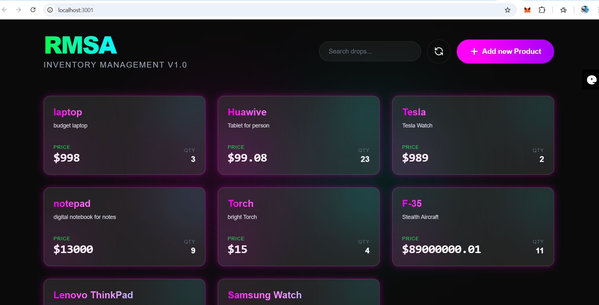
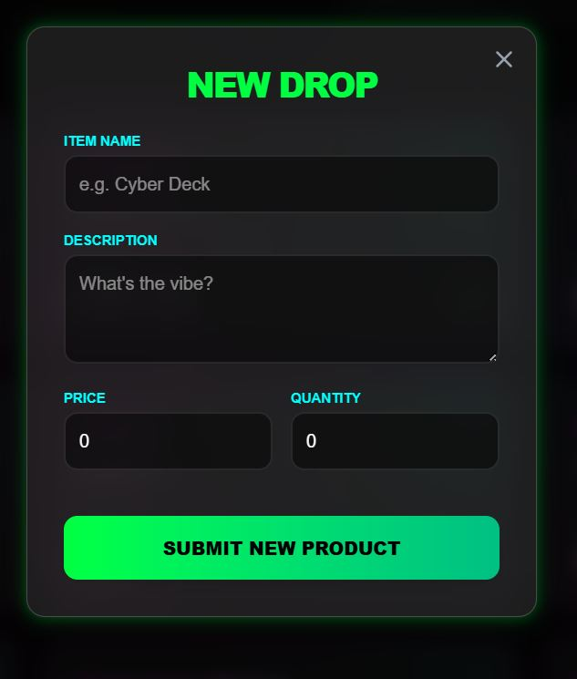
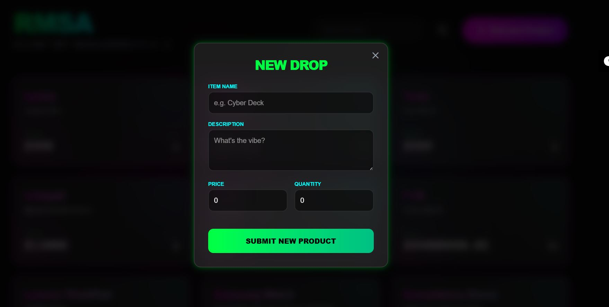

# Product Inventory Management System  
**FastAPI · PostgreSQL · SQLAlchemy · React · Tailwind CSS**

A full-stack **Product Inventory Management System** demonstrating clean REST APIs, database integration, and a modern React frontend.

---

## Screenshots

### Frontend (React + Tailwind CSS)


### Add Product Form


### API Documentation (Swagger)


---

## Features
- CRUD operations for products
- FastAPI RESTful backend
- PostgreSQL with SQLAlchemy ORM
- Auto-incremented database IDs
- Pydantic validation & serialization
- React frontend with Tailwind CSS
- Swagger & ReDoc API documentation

---

## Tech Stack
**Backend:** FastAPI, SQLAlchemy, PostgreSQL, Pydantic, Uvicorn  
**Frontend:** React (Vite), Tailwind CSS, Axios

---

## Run Locally

### Backend
```bash
python -m venv myenv
myenv\Scripts\activate
pip install -r requirements.txt
uvicorn main:app --reload

API: http://127.0.0.1:8000
Docs: http://127.0.0.1:8000/docs

---

### Frontend
```bash
cd frontend
npm install
npm run dev

App: http://localhost:3001

---

## API Example

### Create a Product
**Endpoint:** POST /products

**Request Body**
```json
{
  "name": "EV Bike",
  "description": "Electric bike with 80km range",
  "price": 999,
  "quantity": 2
}
